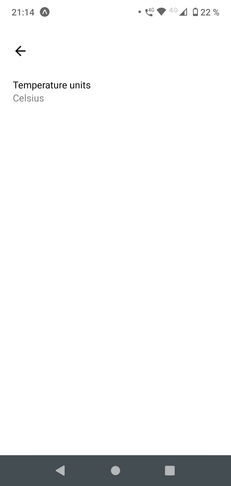

# Weather App

Built with React Native. 

#### Main features
* Gets data from OpenWeather Api
* Displays current weather based on device location
* Displays weather icon based on weather condition
* Changes background based on time of day
* Changes temperature unit based on user input using AsyncStorage and context
* Shows forecast for following week with avarage of high and low temperatures

#### Preview

